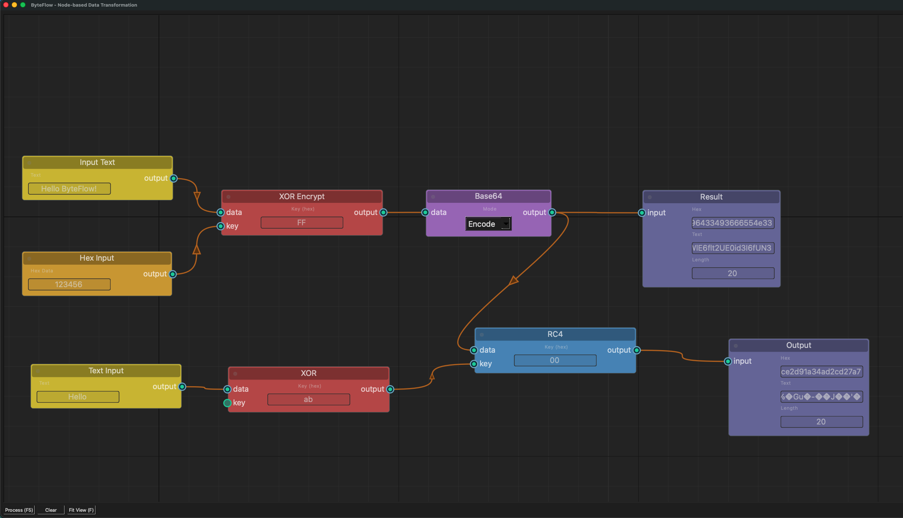

# ByteFlow

A node-based data transformation tool, inspired by CyberChef but with a visual node graph interface.

> **Note**: This is a toy project in alpha state. Use at your own risk.



## Features

- **Visual Node Graph**: Build data transformation pipelines by connecting nodes
- **Crypto Operations**: XOR, RC4, AES (CBC/ECB), Base64 encode/decode
- **I/O Nodes**: Hex input, text input, file input, and output display
- **Interactive UI**: Left-click drag to pan, right-click to add nodes, Delete/Backspace to remove nodes

## Installation

```bash
pip install -r requirements.txt
```

## Usage

```bash
python main.py
```

### Controls

- **Right-click**: Open context menu to add nodes
- **Left-click drag** (on background): Pan the view
- **Left-click drag** (on node): Move the node
- **F**: Fit all nodes in view
- **F5**: Process the graph
- **Delete/Backspace**: Delete selected nodes

## Dependencies

- PySide6
- NodeGraphQt
- pycryptodome

## License

MIT License - see [LICENSE](LICENSE) for details.
